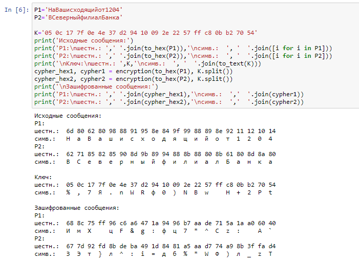

---
## Front matter
lang: ru-RU
title: Отчет по лабораторной работе №8
author: |
	 Астафьева Анна Андреевна НПИбд-01-18\inst{1}

institute: |
	\inst{1}Российский Университет Дружбы Народов

date: Информационная Безопасность--2021, 18 декабря, 2021, Москва, Россия

## Formatting
mainfont: PT Serif
romanfont: PT Serif
sansfont: PT Sans
monofont: PT Mono
toc: false
slide_level: 2
theme: metropolis
header-includes: 
 - \metroset{progressbar=frametitle,sectionpage=progressbar,numbering=fraction}
 - '\makeatletter'
 - '\beamer@ignorenonframefalse'
 - '\makeatother'
aspectratio: 43
section-titles: true

---

# Цели и задачи работы

## Цель лабораторной работы

Освоить на практике применение режима однократного гаммирования на примере кодирования различных исходных текстов одним ключом.

## Задание к лабораторной работе

Два текста кодируются одним ключом (однократное гаммирование).
Требуется не зная ключа и не стремясь его определить, прочитать оба текста.  
Исходные данные.  
Две телеграммы Центра:  
$P_1$ = НаВашисходящийот1204  
$P_2$ = ВСеверныйфилиалБанка   

# Процесс выполнения лабораторной работы

## Процесс выполнения

1. Необходимо разработать приложение и определить вид шифротекстов $C_1$ и $C_2$ обоих текстов $P_1$ и $P_2$ при известном ключе (рис. -@fig:006):

{ #fig:006 width=70% height=70% }

## Процесс выполнения

2. Далее преположим ситуацию, что злоумышленнику каким-то образом удалось заполучить оба сообщения в зашифрованном виде (рис. -@fig:007):

{ #fig:007 width=70% height=70% }

## Процесс выполнения

3. Складывая по модулю шифротексты можно получить гамму (рис. -@fig:008):
$$C_1 \oplus C_2 = P_1 \oplus K \oplus P_2 \oplus K = P_1 \oplus P_2$$

{ #fig:008 width=70% height=70% }

## Процесс выполнения

4. Предположим, что одна из телеграмм является шаблоном — т.е. имеет текст фиксированный формат, в который вписываются значения полей.
Допустим, что злоумышленнику этот формат известен. Таким образом, злоумышленник получает возможность определить те
символы сообщения $P_2$, которые находятся на позициях известного шаблона сообщения $P_1$. 
$$C_1 \oplus C_2 \oplus P_1 = P_1 \oplus P_2 \oplus P_1 = P_2$$
В соответствии с логикой сообщения $P_2$, злоумышленник имеет реальный шанс узнать ещё некоторое количество символов сообщения $P_2$. Затем используется подстановка вместо $P_1$ полученных на предыдущем шаге новых символов сообщения $P_2$. И так далее.  

## Процесс выполнения

{ #fig:0010 width=70% height=70% }

## Процесс выполнения

{ #fig:0011 width=70% height=70% }

# Контрольные вопросы

## Контрольные вопросы

1. Как, зная один из текстов ($P_1$ или $P_2$), определить другой, не зная при этом ключа?  
 
2. Что будет при повторном использовании ключа при шифровании текста?  

3. Как реализуется режим шифрования однократного гаммирования одним ключом двух открытых текстов?
  
4. Перечислите недостатки шифрования одним ключом двух открытых текстов.  
  
5. Перечислите преимущества шифрования одним ключом двух открытых текстов.  

# Выводы по проделанной работе

## Вывод

На основе проделанной работы освоила на практике применение режима однократного гаммирования на примере кодирования различных исходных текстов одним ключом.