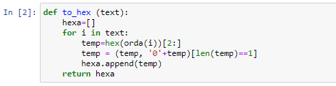

---
# Front matter
lang: ru-RU
title: "Отчет по лабораторной работе №8"
subtitle: "Информационная безопасноть"
author: "Астафьева Анна Андреевна НПИбд-01-18"

# Formatting
toc-title: "Содержание"
toc: true # Table of contents
toc_depth: 2
lof: true # List of figures
fontsize: 12pt
linestretch: 1.5
papersize: a4paper
documentclass: scrreprt
polyglossia-lang: russian
polyglossia-otherlangs: english
mainfont: PT Serif
romanfont: PT Serif
sansfont: PT Sans
monofont: PT Mono
mainfontoptions: Ligatures=TeX
romanfontoptions: Ligatures=TeX
sansfontoptions: Ligatures=TeX,Scale=MatchLowercase
monofontoptions: Scale=MatchLowercase
indent: true
pdf-engine: lualatex
header-includes:
  - \linepenalty=10 # the penalty added to the badness of each line within a paragraph (no associated penalty node) Increasing the υalue makes tex try to haυe fewer lines in the paragraph.
  - \interlinepenalty=0 # υalue of the penalty (node) added after each line of a paragraph.
  - \hyphenpenalty=50 # the penalty for line breaking at an automatically inserted hyphen
  - \exhyphenpenalty=50 # the penalty for line breaking at an explicit hyphen
  - \binoppenalty=700 # the penalty for breaking a line at a binary operator
  - \relpenalty=500 # the penalty for breaking a line at a relation
  - \clubpenalty=150 # extra penalty for breaking after first line of a paragraph
  - \widowpenalty=150 # extra penalty for breaking before last line of a paragraph
  - \displaywidowpenalty=50 # extra penalty for breaking before last line before a display math
  - \brokenpenalty=100 # extra penalty for page breaking after a hyphenated line
  - \predisplaypenalty=10000 # penalty for breaking before a display
  - \postdisplaypenalty=0 # penalty for breaking after a display
  - \floatingpenalty = 20000 # penalty for splitting an insertion (can only be split footnote in standard LaTeX)
  - \raggedbottom # or \flushbottom
  - \usepackage{float} # keep figures where there are in the text
  - \usepackage{amsmath}
  - \floatplacement{figure}{H} # keep figures where there are in the text
---

# Цель работы

Освоить на практике применение режима однократного гаммирования на примере кодирования различных исходных текстов одним ключом.

# Теоретическое описание

Исходные данные.  
Две телеграммы Центра:  

$P_1$ = НаВашисходящийот1204  

$P_2$ = ВСеверныйфилиалБанка  

Ключ Центра длиной 20 байт:  
$K$ = 05 0C 17 7F 0E 4E 37 D2 94 10 09 2E 22 57 FF C8 OB B2 70 54  

Шифротексты обеих телеграмм можно получить по формулам режима однократного гаммирования:  
$$C_1 = P_1 \oplus K_1$$
$$C_2 = P_2 \oplus K_2$$
Открытый текст можно найти, зная шифротекст двух телеграмм, зашифрованных одним ключом. Для это оба равенства складываются по модулю 2. Тогда с учётом свойства операции XOR получаем
$$C_1 \oplus C_2 = P_1 \oplus K \oplus P_2 \oplus K = P_1 \oplus P_2$$
Предположим, что одна из телеграмм является шаблоном — т.е. имеет текст фиксированный формат, в который вписываются значения полей.
Допустим, что злоумышленнику этот формат известен. Таким образом, злоумышленник получает возможность определить те
символы сообщения $P_2$, которые находятся на позициях известного шаблона сообщения $P_1$. 
$$C_1 \oplus C_2 \oplus P_1 = P_1 \oplus P_2 \oplus P_1 = P_2$$
В соответствии с логикой сообщения $P_2$, злоумышленник имеет реальный шанс узнать ещё некоторое количество символов сообщения $P_2$. Затем используется подстановка вместо $P_1$ полученных на предыдущем шаге новых символов сообщения $P_2$. И так далее.  
Действуя подобным образом, злоумышленник даже если не прочитает оба
сообщения, то значительно уменьшит пространство их поиска.

# Выполнение лабораторной работы

Два текста кодируются одним ключом (однократное гаммирование).
Требуется не зная ключа и не стремясь его определить, прочитать оба текста.  
Исходные данные.  
Две телеграммы Центра:  

$P_1$ = НаВашисходящийот1204  

$P_2$ = ВСеверныйфилиалБанка   

  
1. Необходимо разработать приложение, позволяющее шифровать и дешифровать тексты $P_1$ и $P_2$ в режиме однократного гаммирования. Приложение должно определить вид шифротекстов $C_1$ и $C_2$ обоих текстов $P_1$ и $P_2$ при известном ключе ;   

Используем функции из лабораторной работы №7: 

1.1. Функция *encryption* с помощью однократного гаммирования из сообщения и ключа получает шифротекст (рис. -@fig:001). 

{ #fig:001 width=70% height=70% }

1.2. Функция *to_hex*, трансформирующая текст в шестнадцатиричное представление (рис. -@fig:002). 

{ #fig:002 width=70% height=70% }

Написаны еще несколько функций:  

1.3. Функция *to_text*, трансформирующая текст в шестнадцатиричном представлении в символьное (рис. -@fig:003)

{ #fig:003 width=70% height=70% }

1.4. Функция *chra*, преобразовывающая число в символ (рис. -@fig:004)

{ #fig:004 width=70% height=70% }

1.5. Функция *orda*, преобразовывающая символ в число (рис. -@fig:005)

{ #fig:005 width=70% height=70% }

Шифруем оба сообщения (рис. -@fig:006):

{ #fig:006 width=70% height=70% }

2. Необходимо определить и выразить аналитически способ, при котором злоумышленник может прочитать оба текста, не
зная ключа и не стремясь его определить.

Далее преположим ситуацию, что злоумышленнику каким-то образом удалось заполучить оба сообщения в зашифрованном виде (рис. -@fig:007):

{ #fig:007 width=70% height=70% }

Складывая по модулю шифротексты можно получить гамму (рис. -@fig:008):
$$C_1 \oplus C_2 = P_1 \oplus K \oplus P_2 \oplus K = P_1 \oplus P_2$$

{ #fig:008 width=70% height=70% }

Допустим, одна из телеграмм является шаблоном — т.е. имеет текст фиксированный формат, в который вписываются значения полей.
Допустим, что злоумышленнику известен формат телеграммы $P_1$. Ему известны в телеграмме P_1 выделенны жирным части:  
$P_1$ = **НаВаш**исходящий**от**1204.  
Таким образом, злоумышленник получает возможность определить те
символы сообщения $P_2$, которые находятся на позициях известного шаблона сообщения $P_1$:  
$P_2$ = **ВСеве**рныйфилиа**лБ**анка.  
В соответствии с логикой сообщения $P_2$, злоумышленник имеет реальный шанс узнать ещё некоторое количество символов сообщения $P_2$:  
 $P_2$ = **ВСеверный**филиа**лБ**анка.  
Затем используется подстановка полученных на предыдущем шаге новых символов сообщения $P_2$. И так далее.  
Работа описанного выше алгоритма реализована в программе (рис. -@fig:009), (рис. -@fig:0010), (рис. -@fig:0011).

{ #fig:009 width=70% height=70% }

{ #fig:0010 width=70% height=70% }

{ #fig:0011 width=70% height=70% }

# Контрольные вопросы

1. Как, зная один из текстов ($P_1$ или $P_2$), определить другой, не зная при
этом ключа?  
По формуле $C_1 \oplus C_2 \oplus P_1 = P_1 \oplus P_2 \oplus P_1 = P_2$ 
 
2. Что будет при повторном использовании ключа при шифровании текста?  
Текст расшифруется.  

3. Как реализуется режим шифрования однократного гаммирования одним
ключом двух открытых текстов?  
по формулам режима однократного гаммирования:  
$$C_1 = P_1 \oplus K_1$$
$$C_2 = P_2 \oplus K_2$$
  
4. Перечислите недостатки шифрования одним ключом двух открытых
текстов.
- ключ, попав не в те руки, даст возможность злоумышленнику расшифровать оба текста;  
- можно расшифровать с помощью открытого текста другие известные шифротексты;  
- можно узнать часть текста, используя заранее известный шаблон и формат другого текста.  
  
5. Перечислите преимущества шифрования одним ключом двух открытых
текстов.
- скорость шифрования выше;  
- простой алгоритм шифрования;  
- шифротекст сильно меняется, если изменяется ключ или открытый текст.

# Выводы

На основе проделанной работы освоила на практике применение режима однократного гаммирования на примере кодирования различных исходных текстов одним ключом.